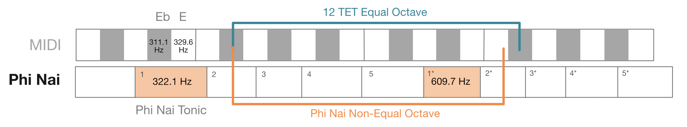
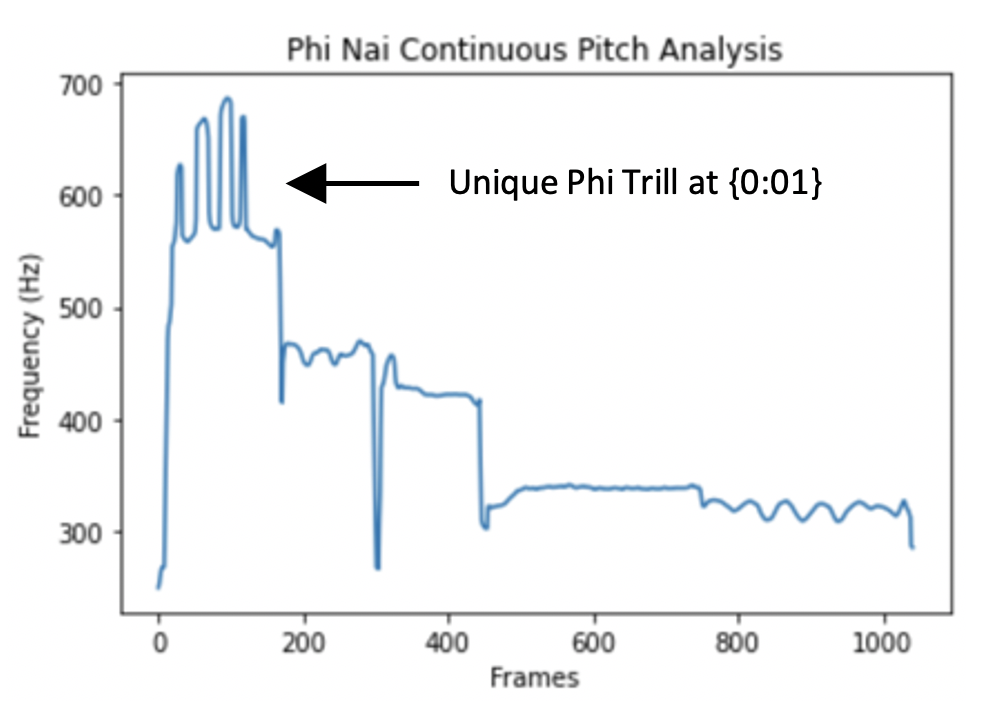
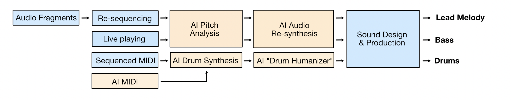

# AI Song Contest 2022 Process Document
## อสุระเทวะชุมนุม - [ญาบอย ฮานอย](https://www.tiktok.com/@yaboihanoi?lang=en)
## Enter Demons & Gods – [Yaboi Hanoi](https://www.instagram.com/yaboihanoi/)

<iframe width="100%" height="300" scrolling="no" frameborder="no" allow="autoplay" src="https://w.soundcloud.com/player/?url=https%3A//api.soundcloud.com/tracks/1277908936%3Fsecret_token%3Ds-uScb2JjZjP8&color=%23ff5500&auto_play=false&hide_related=false&show_comments=true&show_user=true&show_reposts=false&show_teaser=true&visual=true"></iframe>
<a href="https://soundcloud.com/user-458660217" title="yaboihanoi" target="_blank" style="color: #cccccc; text-decoration: none;">yaboihanoi</a> · <a href="https://soundcloud.com/user-458660217/enter-demons-and-gods/s-uScb2JjZjP8" title="อสุระเทวะชุมนุม - Enter Demons &amp; Gods" target="_blank" style="color: #cccccc; text-decoration: none;">อสุระเทวะชุมนุม - Enter Demons &amp; Gods</a>

### Empowering music from Southeast Asia and beyond
_“I often find it difficult to use AI in writing music inspired by my home country - Thailand.”_

Most AI models are rooted in Western definitions of melody, harmony, and tuning. For example, training datasets contain mainly Western genres like classical, rock and pop. Models can only output notes on keys of a piano i.e. a 12-tone equal temperament tuning (12-TET). Thai classical music does not follow these conventions. Neither does music from Indonesia, Vietnam and countries from Southeast Asia, the Middle East and Africa. Historically, these built-in assumptions have made it near-impossible to apply music machine learning (ML) to these traditions.

My submission aims to demonstrate how advancements in realtime audio ML enable unprecedented audio synthesis with respect to a culture’s native tuning. It manifests my longstanding [vision] and research on how AI can empower sonic cultures from Southeast Asia and beyond. The song is entitled อสุระเทวะชุมนุม (“Asura Deva Choom Noom”) - Enter Demons & Gods. 

[vision]: https://magenta.tensorflow.org/transcultural

### Meet the ปี่ “Phi”: a case study of incompatibilities in Music AI
One of my favorite Thai instruments is the ปี่ “[Phi]”, a double reeded instrument similar to a concert oboe but more piercing in tone. Its rousing timbre is an integral part of Thai culture: from hyping-up roaring crowds during มวยไทย “[Muay Thai]” boxing matches to calling for people’s attention during a ceremony’s [opening].

Music centered around the Phi demonstrate how most symbolic models fall short outside of Bach, Bieber and the Beatles. The diagram below shows how Phi intervals across two octaves do not align with MIDI notes used to represent Western music as data. There is no way of feeding Phi melodies into an AI model for it to analyze, and no way for the model to express melodic responses in Phi pitch space. 

This particular Phi, called a ปี่ใน “[Phi Nai]”, has no octave equivalence. For many notes an octave is closer to, but not exactly, a major 7th. The tonic also sits at 322 Hz between E and Eb. In the past, this would have marked my dead-end. How does one begin to use AI, let alone a piano-roll in Ableton, to write music in “E slightly quarter-tone flat with no equal octaves”? Not anymore. Enter audio machine learning (audio ML).

<iframe width="560" height="315" src="https://www.youtube.com/embed/l9RsMX2dQ40" title="YouTube video player" frameborder="0" allow="accelerometer; autoplay; clipboard-write; encrypted-media; gyroscope; picture-in-picture" allowfullscreen></iframe>

[Phi]: https://www.youtube.com/watch?v=23CNamoA6Tk&feature=share
[Muay Thai]: https://www.youtube.com/watch?v=nI8Fag789Do
[opening]: https://www.youtube.com/watch?v=H9mFN1F1SRY&feature=youtu.be
[Phi Nai]: https://www.youtube.com/watch?v=l9RsMX2dQ40

### Audio Machine Learning: Neural Pitch Detection and Neural Audio Synthesis
The opening trill at {[0:01], [0:40]} features a distinct motif from Phi Nai repertoire; synthesized in realtime using audio ML. A pair of AI systems model music at the level of frequencies (audio AI models) instead of discrete notes (symbolic AI models). Given a monophonic melody like those from a Phi, ML-based pitch detection models like “[CREPE]” and “[SPICE]” can output accurate frequency measurements in hertz (Hz). I could analyze a Phi Nai’s melodic inflections with unprecedented precision (see figure).

<iframe width="100%" height="166" scrolling="no" frameborder="no" allow="autoplay" src="https://w.soundcloud.com/player/?url=https%3A//api.soundcloud.com/tracks/1277781574&color=%23ff5500&auto_play=false&hide_related=false&show_comments=true&show_user=true&show_reposts=false&show_teaser=true"></iframe>
<a href="https://soundcloud.com/user-458660217" title="yaboihanoi" target="_blank" style="color: #cccccc; text-decoration: none;">yaboihanoi</a> · <a href="https://soundcloud.com/user-458660217/1-phi-nai-opening-trill" title="1 Phi Nai ปี่ใน Opening Trill" target="_blank" style="color: #cccccc; text-decoration: none;">1 Phi Nai ปี่ใน Opening Trill</a>

[0:01]: https://soundcloud.com/user-458660217/1-phi-nai-opening-trill?in=user-458660217/sets/enter-demons-gods-ai-song-contest-stems&utm_source=clipboard&utm_medium=text&utm_campaign=social_sharing
[0:40]: https://soundcloud.com/user-458660217/2-phi-nai-trill-ensemble?in=user-458660217/sets/enter-demons-gods-ai-song-contest-stems&utm_source=clipboard&utm_medium=text&utm_campaign=social_sharing
[CREPE]: https://arxiv.org/abs/1802.06182
[SPICE]: https://arxiv.org/abs/1910.11664v1

This pitch information can then be fed into a second ML model based on Differentiable Digital Signal Processing ([DDSP]), an [open-source] library I co-invented with [Magenta] as an AI Resident at Google Brain. A DDSP model trained on a saxophone can re-render this continuous pitch data as though a sax played the same motif; down to identical inflections measured in Hz.

_“It was like a saxophonist trained in classical Thai motifs, who played a special ‘Thai Edition’ saxophone with Phi Nai tunings, had joined the musical conversation. The same was true with the trumpet model and the ขลุ่ย ‘Khlui’ - a flute from Thai, Laos and Cambodian repertoire. I could assemble a transcultural [ensemble] to expand the sonic palette of Thai motifs, whilst adhering to underlying tunings and idiomatic inflections like never before.”_

[DDSP]: https://arxiv.org/abs/2001.04643
[open-source]: https://github.com/magenta/ddsp
[Magenta]: https://magenta.tensorflow.org/ddsp
[ensemble]: https://soundcloud.com/user-458660217/2-phi-nai-trill-ensemble?in=user-458660217/sets/enter-demons-gods-ai-song-contest-stems&utm_source=clipboard&utm_medium=text&utm_campaign=social_sharing

<iframe width="100%" height="166" scrolling="no" frameborder="no" allow="autoplay" src="https://w.soundcloud.com/player/?url=https%3A//api.soundcloud.com/tracks/1277781550&color=%23ff5500&auto_play=false&hide_related=false&show_comments=true&show_user=true&show_reposts=false&show_teaser=true"></iframe>
<a href="https://soundcloud.com/user-458660217" title="yaboihanoi" target="_blank" style="color: #cccccc; text-decoration: none;">yaboihanoi</a> · <a href="https://soundcloud.com/user-458660217/2-phi-nai-trill-ensemble" title="2 Phi Nai ปี่ใน Trill Ai Re-synthesis" target="_blank" style="color: #cccccc; text-decoration: none;">2 Phi Nai ปี่ใน Trill Ai Re-synthesis</a>

### Creating the lead melody
Inspired, I collected, spliced and time-warped notes and fragments from archival recordings of Phi Nai folk tunes. I was drawn to motifs from สาธุการ “[Sadhukarn]” used in โหมโรง “Homrong” or Thai musical overtures. I re-sequenced these into the main [melodic] idea {0:22-0:41} and re-rendered it using DDSP’s “[Colab] Notebook”, Google’s “[Tone Transfer]” and TikTok’s brand new plugin “[MAWF]”. As one of the AI Research Scientists who developed code and models in all these systems, I knew highly transient material with fundamental frequencies between 300-800 Hz worked best.

The opening trill was a happy accident composed of 4 instances of MAWF with effects and volume automation to modulate timbre. Although the Colab Notebook offered higher precision pitch tracking, I found MAWF more musically inspiring as it was realtime. I could orchestrate expressive melodies because MAWF synthesized low-latency audio at 48kHz on consumer laptops; a step-up from lower quality 16kHz and offline server rendering typical of ML research. Although methods derived from [SampleRNN], [WaveNet] and Jukebox may output similar sounds, non can match the precise frequency and realtime control of this approach.

<iframe width="100%" height="166" scrolling="no" frameborder="no" allow="autoplay" src="https://w.soundcloud.com/player/?url=https%3A//api.soundcloud.com/tracks/1277781523&color=%23ff5500&auto_play=false&hide_related=false&show_comments=true&show_user=true&show_reposts=false&show_teaser=true"></iframe>
<a href="https://soundcloud.com/user-458660217" title="yaboihanoi" target="_blank" style="color: #cccccc; text-decoration: none;">yaboihanoi</a> · <a href="https://soundcloud.com/user-458660217/3-phi-nai-main-melody" title="3 Phi Nai ปี่ใน Main Melody" target="_blank" style="color: #cccccc; text-decoration: none;">3 Phi Nai ปี่ใน Main Melody</a>

_“This workflow centered around Thai music would not be possible with traditional tools. Sample libraries like Kontakt discretely record instruments assuming inputs in 12-TET. Most synths expect a keyboard input, not continuous pitch data in Hz. Even “micro-tuning” functions in DAWs fall short because they do not allow idiomatic trills and cultural inflections to be accurately expressed. This application of audio ML empowers artists like myself to make music that does not compromise the tunings and cultural motifs at the heart of our musical identity.”_

[Sadhukarn]: https://www.youtube.com/watch?v=l9RsMX2dQ40
[melodic]: https://soundcloud.com/user-458660217/3-phi-nai-main-melody?in=user-458660217/sets/enter-demons-gods-ai-song-contest-stems&utm_source=clipboard&utm_medium=text&utm_campaign=social_sharing
[Colab]: https://colab.research.google.com/github/magenta/ddsp/blob/master/ddsp/colab/demos/timbre_transfer.ipynb#scrollTo=Vn1ahslLbXJ5
[Tone Transfer]: https://sites.research.google/tonetransfer
[MAWF]: https://mawf.io/
[SampleRNN]: https://arxiv.org/abs/1612.07837
[WaveNet]: https://arxiv.org/abs/1609.03499
[Jukebox]: https://openai.com/blog/jukebox/

### Enter Demons and Gods (Creating the Bass)
If you’ve ever exited immigration at Suvarnabhumi international airport in Bangkok, you may have walked into this [sculpture] inspired by Thai mythology. Hundreds of demons and angels descend upon the ocean to churn an elixir of immortality. “My song depicts the earth-shattering entrance of these two formidable forces. If one of these demons played Phi, it would sound like this bass.”

<iframe width="100%" height="166" scrolling="no" frameborder="no" allow="autoplay" src="https://w.soundcloud.com/player/?url=https%3A//api.soundcloud.com/tracks/1277781505&color=%23ff5500&auto_play=false&hide_related=false&show_comments=true&show_user=true&show_reposts=false&show_teaser=true"></iframe>
<a href="https://soundcloud.com/user-458660217" title="yaboihanoi" target="_blank" style="color: #cccccc; text-decoration: none;">yaboihanoi</a> · <a href="https://soundcloud.com/user-458660217/4-opening-bass-siren" title="4 Opening Bass Siren" target="_blank" style="color: #cccccc; text-decoration: none;">4 Opening Bass Siren</a>

The bass sound design evokes a demonic and aggressive re-imagination of the Phi Nai. I used MAWF’s ability to synthesize “breath noises” to layer and create a bass sound the demon overture could have “blown” to signal their arrival {[0:13], [1:29]}.  Producers often layer noise in a similar manner to make bass sounds more thrilling and epic.

<iframe width="100%" height="166" scrolling="no" frameborder="no" allow="autoplay" src="https://w.soundcloud.com/player/?url=https%3A//api.soundcloud.com/tracks/1277781478&color=%23ff5500&auto_play=false&hide_related=false&show_comments=true&show_user=true&show_reposts=false&show_teaser=true"></iframe>
<a href="https://soundcloud.com/user-458660217" title="yaboihanoi" target="_blank" style="color: #cccccc; text-decoration: none;">yaboihanoi</a> · <a href="https://soundcloud.com/user-458660217/5-bass-hiphop" title="5 Bass HipHop" target="_blank" style="color: #cccccc; text-decoration: none;">5 Bass HipHop</a>

MAWF alone cannot produce sub-bass. I turned to tuning techniques taught by Khyam Allami in our recently released Common Tonalities project. Using MTS-ESP, synths like Arturia’s JUP-8 can be re-tuned to match Phi Nai frequencies detected by CREPE and Melodyne. MAWF can continue pitch-tracking this Thai-tuned bass and fill higher frequency sizzles. I played this bass patch like a counter-melody: leveraging my knowledge of Thai music, carefully studying motifs from Phi Nai repertoire and melding these with bass lines typical of Flux Pavilion and electronic bass music {[2:10]}.

<iframe width="100%" height="166" scrolling="no" frameborder="no" allow="autoplay" src="https://w.soundcloud.com/player/?url=https%3A//api.soundcloud.com/tracks/1277781436&color=%23ff5500&auto_play=false&hide_related=false&show_comments=true&show_user=true&show_reposts=false&show_teaser=true"></iframe>
<a href="https://soundcloud.com/user-458660217" title="yaboihanoi" target="_blank" style="color: #cccccc; text-decoration: none;">yaboihanoi</a> · <a href="https://soundcloud.com/user-458660217/7-bass-demon-blow" title="7 Demon Blowing Bass" target="_blank" style="color: #cccccc; text-decoration: none;">7 Demon Blowing Bass</a>

[sculpture]: https://th.bing.com/th/id/R.4816fd0ad73e3e8f10e84e2b05953626?rik=YZK47hQXdP16Kw&riu=http%3a%2f%2fp.motionelements.com%2fstock-video%2farchitecture-buildings%2fme1767703-bangkok-suvarnabhumi-airport-timelapse-thailand-hd-a0005.jpg&ehk=aj5sAQbwwzZbXOW4aaKqgOCfHQwwtihP3wkM66urG2g%3d&risl=&pid=ImgRaw&r=0
[0:13]: https://soundcloud.com/user-458660217/4-opening-bass-siren?in=user-458660217/sets/enter-demons-gods-ai-song-contest-stems&utm_source=clipboard&utm_medium=text&utm_campaign=social_sharing
[1:29]: https://soundcloud.com/user-458660217/7-bass-demon-blow?in=user-458660217/sets/enter-demons-gods-ai-song-contest-stems&utm_source=clipboard&utm_medium=text&utm_campaign=social_sharing
[2:10]: https://soundcloud.com/user-458660217/7-bass-demon-blow?in=user-458660217/sets/enter-demons-gods-ai-song-contest-stems&utm_source=clipboard&utm_medium=text&utm_campaign=social_sharing

### Re-imagining live performance of Thai repertoire with audio ML

_“If a Phi Nai player stepped on stage to perform a live set with me, they could jam to this song immediately. The instrument need not be re-tuned to Western scales.”_

In contemporary Thai music, instruments like the ระนาด “Ranard” xylophone and ขลุ่ย “Khlui” flute are modified or purpose-built in Western tunings to play with pianos and guitars in classical, rock and pop genres. In fact, this shift in performer and listener behavior has made buying and playing instruments in native tuning quite unpopular. 

This submission aims to show how local Southeast Asian instruments can be re-imagined through audio ML in the context of modern genres, whilst celebrating fundamental aspects of our musical cultures like tuning. Because MAWF runs in realtime, the melody and bass can be performed live through a normal Ableton effects rack and extended to Phi players from neighboring Laos, Cambodia and other countries. 

Listeners may feel especially moved by bass music in tunings from Thailand. Naturally occurring intervals in this piece may sound particularly “demonic” as they flirt with a tritone i.e. the “devil’s interval” in Western music. Audio ML systems like MAWF which track and render notes with non-octave equivalence makes the bass all the more [unsettling] {0:58, 1:38}. I deepened this sensation with tremolos and [textures] from MAWF using similar intervals {1:39}.

<iframe width="100%" height="166" scrolling="no" frameborder="no" allow="autoplay" src="https://w.soundcloud.com/player/?url=https%3A//api.soundcloud.com/tracks/1277781463&color=%23ff5500&auto_play=false&hide_related=false&show_comments=true&show_user=true&show_reposts=false&show_teaser=true"></iframe>
<a href="https://soundcloud.com/user-458660217" title="yaboihanoi" target="_blank" style="color: #cccccc; text-decoration: none;">yaboihanoi</a> · <a href="https://soundcloud.com/user-458660217/6-bass-tritones" title="6 Bass Tritones" target="_blank" style="color: #cccccc; text-decoration: none;">6 Bass Tritones</a>

<iframe width="100%" height="166" scrolling="no" frameborder="no" allow="autoplay" src="https://w.soundcloud.com/player/?url=https%3A//api.soundcloud.com/tracks/1277781406&color=%23ff5500&auto_play=false&hide_related=false&show_comments=true&show_user=true&show_reposts=false&show_teaser=true"></iframe>
<a href="https://soundcloud.com/user-458660217" title="yaboihanoi" target="_blank" style="color: #cccccc; text-decoration: none;">yaboihanoi</a> · <a href="https://soundcloud.com/user-458660217/8-textures" title="8 Textures" target="_blank" style="color: #cccccc; text-decoration: none;">8 Textures</a>

I strive for a new normal where modern electronic music woven with instruments in native tunings, both real and AI generated, becomes a part of everyday culture: from entertaining international head-bobbing audiences at Coachella, to provincial communities in Thailand where festive gatherings at home, temple fairs and local elections are not complete without a Phi. “When the music of an instrument, synth, human, machine or AI has the เเม่เสียง or ‘sonic DNA’…it will naturally find a way to speak and connect to community.” 

[unsettling]: https://soundcloud.com/user-458660217/6-bass-tritones?utm_source=clipboard&utm_medium=text&utm_campaign=social_sharing
[textures]: https://soundcloud.com/user-458660217/8-textures

	
### Drop the beat (and my insecurities playing drums)

I don’t play drums. [Magenta Studio]’s “Drumify” plugin has been a regular part of my creative process. Much like a producer keeps a folder of funky drum breaks, I’ve kept a folder of funky Drumify rhythms. When direct input of the melody into Drumify didn’t yield groovy results, I found a previous rhythm which, after some tweaking, worked really well with the verse {1:31}. To connect with a wider audience, I wanted rhythms rooted in more popular genres. Drumify’s underlying dataset of rock, hip hop and funk drummers was well-matched for this criteria.

[Magenta Studio]: https://magenta.tensorflow.org/studio/ableton-live

Instead of triggering pre-existing drum samples with Drumify, I investigated a new [diffusion] model “[CRASH]” capable of high quality 44.1kHz drum synthesis. Interpolating hi-hats in latent space creates hits with small and pleasant variations in timbre {[0:21], [1:34]}, much like how producers avoid repetitive hi-hats by modifying velocity and filter cutoff of a single sample. Unlike most electronic songs, every [kick] {0:21}, [snare] {0:22} and hi-hat in this track is “interpolated” slightly different from the last one. 

[diffusion]: https://arxiv.org/abs/2106.07431
[CRASH]: https://crash-diffusion.github.io/crash/
[0:21]: https://soundcloud.com/user-458660217/12-hihat-interpolate-2?in=user-458660217/sets/enter-demons-gods-ai-song-contest-stems&utm_source=clipboard&utm_medium=text&utm_campaign=social_sharing
[1:34]: https://soundcloud.com/user-458660217/11-hihat-interpolate?in=user-458660217/sets/enter-demons-gods-ai-song-contest-stems&utm_source=clipboard&utm_medium=text&utm_campaign=social_sharing
[kick]: https://soundcloud.com/user-458660217/9-kicks-interpolate?in=user-458660217/sets/enter-demons-gods-ai-song-contest-stems&utm_source=clipboard&utm_medium=text&utm_campaign=social_sharing
[snare]: https://soundcloud.com/user-458660217/10-snare-interpolate?in=user-458660217/sets/enter-demons-gods-ai-song-contest-stems&utm_source=clipboard&utm_medium=text&utm_campaign=social_sharing

<iframe width="100%" height="166" scrolling="no" frameborder="no" allow="autoplay" src="https://w.soundcloud.com/player/?url=https%3A//api.soundcloud.com/tracks/1277781262&color=%23ff5500&auto_play=false&hide_related=false&show_comments=true&show_user=true&show_reposts=false&show_teaser=true"></iframe>
<a href="https://soundcloud.com/user-458660217" title="yaboihanoi" target="_blank" style="color: #cccccc; text-decoration: none;">yaboihanoi</a> · <a href="https://soundcloud.com/user-458660217/11-hihat-interpolate" title="11 Hihat Interpolate" target="_blank" style="color: #cccccc; text-decoration: none;">11 Hihat Interpolate</a>

<iframe width="100%" height="166" scrolling="no" frameborder="no" allow="autoplay" src="https://w.soundcloud.com/player/?url=https%3A//api.soundcloud.com/tracks/1277781223&color=%23ff5500&auto_play=false&hide_related=false&show_comments=true&show_user=true&show_reposts=false&show_teaser=true"></iframe>
<a href="https://soundcloud.com/user-458660217" title="yaboihanoi" target="_blank" style="color: #cccccc; text-decoration: none;">yaboihanoi</a> · <a href="https://soundcloud.com/user-458660217/12-hihat-interpolate-2" title="12 Hihat Interpolate 2" target="_blank" style="color: #cccccc; text-decoration: none;">12 Hihat Interpolate 2</a>

<iframe width="100%" height="166" scrolling="no" frameborder="no" allow="autoplay" src="https://w.soundcloud.com/player/?url=https%3A//api.soundcloud.com/tracks/1277781349&color=%23ff5500&auto_play=false&hide_related=false&show_comments=true&show_user=true&show_reposts=false&show_teaser=true"></iframe>
<a href="https://soundcloud.com/user-458660217" title="yaboihanoi" target="_blank" style="color: #cccccc; text-decoration: none;">yaboihanoi</a> · <a href="https://soundcloud.com/user-458660217/9-kicks-interpolate" title="9 Kicks Interpolate" target="_blank" style="color: #cccccc; text-decoration: none;">9 Kicks Interpolate</a>

<iframe width="100%" height="166" scrolling="no" frameborder="no" allow="autoplay" src="https://w.soundcloud.com/player/?url=https%3A//api.soundcloud.com/tracks/1277781295&color=%23ff5500&auto_play=false&hide_related=false&show_comments=true&show_user=true&show_reposts=false&show_teaser=true"></iframe>
<a href="https://soundcloud.com/user-458660217" title="yaboihanoi" target="_blank" style="color: #cccccc; text-decoration: none;">yaboihanoi</a> · <a href="https://soundcloud.com/user-458660217/10-snare-interpolate" title="10 Snare Interpolate" target="_blank" style="color: #cccccc; text-decoration: none;">10 Snare Interpolate</a>

The beat during the opening {0:22} and drop {2:09} were programmed by hand and MIDI hits humanized by Magenta Studio’s “Groove” to introduce natural delays like a drummer. Compared to purely audio ML models, I found separating drum arrangement into symbolic generation via MIDI (Magenta Studio) and then triggering synthesized one-shots (CRASH) to yield more precise rhythmic results.

### Transcultural Machine Learning in Music

It’s exciting to see realtime audio ML tools unlock new pathways for Thai and electronic music to supercharge one another. Developing AI tools like MAWF and DDSP to empower transcultural music-making continues to underpin all my technical and artistic work. I hope my submission and the AI Song Contest platform can inspire like-minded composers, especially from the Asia-Pacific, Middle-East and Africa, to apply these techniques to their traditions, and invite musicians from the West to explore, understand and experiment with musical inflections in the way our cultures experience them.

ML Engineering: Yaboi Hanoi

Composition and Arrangement: Yaboi Hanoi

Production and Mixing: Yaboi Hanoi

